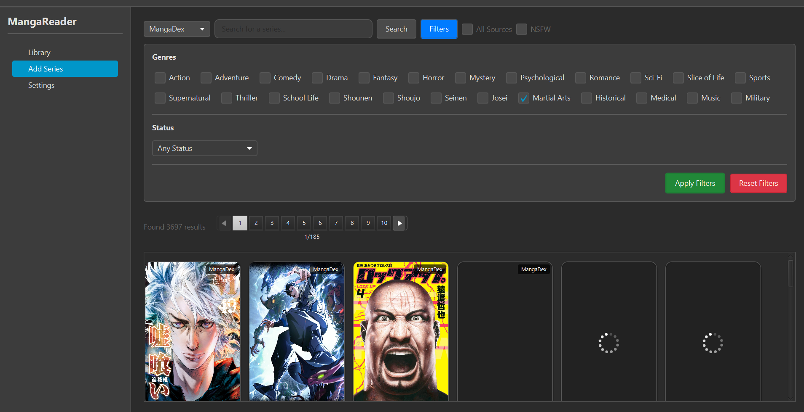

# Project PPT Documentation

Project: Manga Reader Application  
Language: Java (JavaFX), Maven  
Java version: JDK 17  
Focus: Data Structures, Algorithms, Caching, Concurrency


---

## 1. Introduction

- Background: Reading manga from the web is network-bound and UI-heavy. Without caching and efficient structures, repeated image loads and naive searches cause lag and high bandwidth.
- Purpose: Provide a desktop manga reader with fast search, responsive UI, and aggressive caching, aggregating content from multiple sources via a unified API.
- Scope: Includes browsing/searching manga, viewing details/chapters, reading with cached images, maintaining a local library. Excludes account auth/sync and multi-user roles.

---

## 2. Objectives

 - Implement a responsive reader backed by efficient data structures:
  - O(1) library lookups via a thread-safe map (ConcurrentHashMap).
  - Rule-based filtering and sorting for chapters.
  - Two-level image cache (memory + disk) with MD5 file hashing.
  - Thread pool + blocking queue for background tasks.
- Measurable targets:
  - Chapter filter/sort under ~10ms for a few hundred items.
  - Reduce network image loads by >95% after warm cache.
  - Keep UI thread unblocked during image fetches and searches.

---

## 3. System Overview

- System Concept: JavaFX desktop app; domain services fetch from pluggable sources implementing `MangaSource`. Images are cached; library persists to JSON.
- Users: End-user readers managing a local library and reading chapters.
- System Requirements:
  - Software: JDK 17, Maven 3.8+, Internet (for online sources).
  - Libraries: JavaFX, Jackson (JSON), Java Concurrency utils.
  - Files: `pom.xml`, data at `data/library.json`, cache at `cache/images/`.


---

## 4. Data Structures Used

1) ConcurrentHashMap (thread-safe map)
- Where: `LibraryService` (library map), `ImageCache` (memory image cache).
- Purpose: Thread-safe O(1) average add/get/remove during concurrent background tasks.
- Justification: Avoids global lock contention of synchronized maps; safe vs. non-thread-safe `HashMap`.

2) FilteredList and SortedList (JavaFX Collections)
- Where: UI lists (e.g., chapters in views).
- Purpose: Live filtering and sorting without duplicating collections.
- Justification: Stable, faster when the list is almost sorted (TimSort) and efficient filter-rule updates.

3) ArrayList
- Where: `MangaServiceImpl` sources list, in-memory lists of manga/chapters.
- Purpose: Cache ordered results; fast iteration and indexed access.
- Justification: Amortized O(1) append; better cache locality than linked lists.

4) Task queue (LinkedBlockingQueue) + ThreadPoolExecutor
- Where: `ThreadPoolManager.java` (background image/tasks).
- Purpose: FIFO task scheduling; bounded queue protects memory.
- Justification: Keeps UI responsive; prevents overload under heavy work.

5) HashMap (UI node cache)
- Where: View-level caches of JavaFX nodes (e.g., `AddSeriesView` cover tiles) to avoid expensive recreation.
- Purpose: O(1) reuse of nodes by ID.
- Justification: Drastically reduces repeated layout/render construction.

---

## 5. Algorithm Design

1) Chapter Filtering + Sorting
- Idea: Check each item using a filter rule, then apply a sorting rule per selected mode (newest/oldest/by volume).
- Pseudocode:
```
filterChapters(searchText, volumeFilter):
  p1 := chapter.title contains searchText || number contains searchText
  p2 := chapter.volume matches volumeFilter (or all)
  filtered := chapters where p1 && p2
  sort filtered with comparator per mode
```

- Step-by-step:
  1. Normalize search text (lowercase).
  2. Build a text filter rule (match in title or number).
  3. Build a volume filter rule based on dropdown selection.
  4. Combine filter rules (AND) and assign to FilteredList.
  5. Apply a sorting rule based on the selected option.

2) Two-Level Image Cache Lookup
- Idea: Check memory → disk → network, promoting on hit and persisting on download.
- Pseudocode:
```
getImage(url, w, h):
  if memoryCache.contains(url): return memoryCache[url]
  file := cacheDir / md5(url) + ".jpg"
  if file exists and valid: img := load(file); memoryCache[url] = img; return img
  img := download(url); if ok: save(file); memoryCache[url] = img; return img
  return placeholder
```

- Step-by-step:
  1. Lookup image URL in memory map (O(1)).
  2. If miss, compute MD5 filename and check disk path.
  3. Validate disk file (size > 1KB, decodes without error).
  4. If valid, load and also store it in memory for next time.
  5. If miss/corrupt, download from network and save to disk and memory.

3) Multi-Source Search Aggregation
- Idea: Iterate all `MangaSource` implementations and combine results.
- Pseudocode:
```
searchAllSources(q):
  results := []
  for source in sources:
    try: results += source.search(q)
    catch: log and continue
  return results
```

- Step-by-step:
  1. Iterate registered sources in order.
  2. For each, run `search(query)` on the API pool.
  3. Collect results; on exception, log and continue.
  4. Return combined list (optionally remove duplicates by ID).

---

## 6. Implementation

- Language and Libraries
  - Java 17, JavaFX.
  - Jackson (JSON serialization), java.util.concurrent.
  - Maven build (`pom.xml`).

- Key snippets

Concurrent library storage (O(1) avg):
```java
// src/main/java/com/mangareader/prototype/service/LibraryService.java
private final Map<String, LibraryEntry> library = new java.util.concurrent.ConcurrentHashMap<>();

public boolean addToLibrary(Manga manga) {
    LibraryEntry entry = new LibraryEntry(manga, java.time.LocalDateTime.now());
    library.put(manga.getId(), entry);
    saveLibrary();
    return true;
}
```

Rule-based filtering + sorting:
```java
// In views using JavaFX collections
FilteredList<Chapter> filtered = new FilteredList<>(chapters, p -> true);
SortedList<Chapter> sorted = new SortedList<>(filtered);
filtered.setPredicate(ch -> match(ch, searchText, volumeFilter));
sorted.setComparator(ChapterComparators.byOption(option));
```

MD5 filename hashing for disk cache:
```java
// src/main/java/com/mangareader/prototype/util/ImageCache.java
private String getCacheFileName(String url) {
    try {
        var md = java.security.MessageDigest.getInstance("MD5");
        byte[] hash = md.digest(url.getBytes());
        var sb = new StringBuilder();
        for (byte b : hash) sb.append(String.format("%02x", b));
        return sb.toString() + ".jpg";
    } catch (java.security.NoSuchAlgorithmException e) {
        return String.valueOf(url.hashCode()) + ".jpg";
    }
}
```

- Thread pools (reference): see `src/main/java/com/mangareader/prototype/util/ThreadPoolManager.java` for configuration using `ThreadPoolExecutor` + `LinkedBlockingQueue` and a named `ThreadFactory` for debugging.

---

## 7. Testing and Results

- Test Cases
  1) Image Cache Warm-up
     - Input: Request same cover URL twice.
     - Expected: First load via network; second from disk/memory.
     - Actual: First ~hundreds ms (network), second ~10ms (disk) or ~0.1ms (memory).

  2) Chapter Search/Filter
     - Input: searchText="10", volumeFilter="All".
     - Expected: Only chapters with "10" in title/number remain visible.
     - Actual: Filter applied in real-time; sort changes reflect immediately.

  3) Library Lookup
     - Input: Add N manga, then query by ID.
     - Expected: `isInLibrary(id)` O(1) true for existing, false otherwise.
     - Actual: Operations constant-time under concurrent access.

 - Screenshots:
  - **Library grid:**
    - Default/Dark: 
    - Light theme: 
  - **Add Series flow:**
    - 
    - 
    - 
   - **View Series (modal):** 
  - **Manga detail view:** 
  - **Reader view:** 
  - **Chapter filter demos:**
    - 
    - 
    - 
    - 
  - **Settings:**
    - 
    - 
    - 


---

## 8. Conclusion and Recommendations

- Summary
  - Achieved responsive UI with efficient DS/Algos: O(1) map lookups, faster sorting when lists are almost sorted, real-time filtering, two-level image cache, and background execution.
  - Network usage reduced drastically after cache warm-up.

- Lessons Learned
  - Concurrency needs thread-safe structures and bounded queues.
  - File hashing simplifies cross-platform caching and path length concerns.

- Suggested Improvements
  - Add LRU eviction for memory cache; size/age-based cleanup for disk cache.
  - Introduce rate limiting/retries per source; structured error handling.
  - Optional: full-text search index (inverted index) for faster multi-field queries.
  - Add automated unit/UI tests for library, caching, and search behaviors.

---

## 9. References

The following entries cite the exact libraries and web API used in this project, with versions matching `pom.xml` and links to their authoritative sources.

- OpenJFX. (2024). OpenJFX (Version 21.0.2) [Computer software]. https://openjfx.io/
- FasterXML. (2023, December 24). Jackson Databind (Version 2.16.1) [Computer software]. https://github.com/FasterXML/jackson-databind
- FasterXML. (2023). Jackson Datatype: JSR-310 (Version 2.16.1) [Computer software]. https://github.com/FasterXML/jackson-modules-java8
- Hedley, J. (2023, December 29). jsoup: Java HTML parser (Version 1.17.2) [Computer software]. https://jsoup.org/news/release-1.17.2
- The Apache Software Foundation. (2023). Apache HttpClient (Version 5.3) [Computer software]. https://hc.apache.org/httpcomponents-client-5.3.x/
- The Apache Software Foundation. (2023). Apache HttpCore (Version 5.3) [Computer software]. https://hc.apache.org/httpcomponents-core-5.3.x/
- JUnit Team. (2023, November 6). JUnit 5 (Version 5.10.1) [Computer software]. https://junit.org/junit5/docs/5.10.1/release-notes/
- MangaDex. (2025). MangaDex API documentation. https://api.mangadex.org/docs

